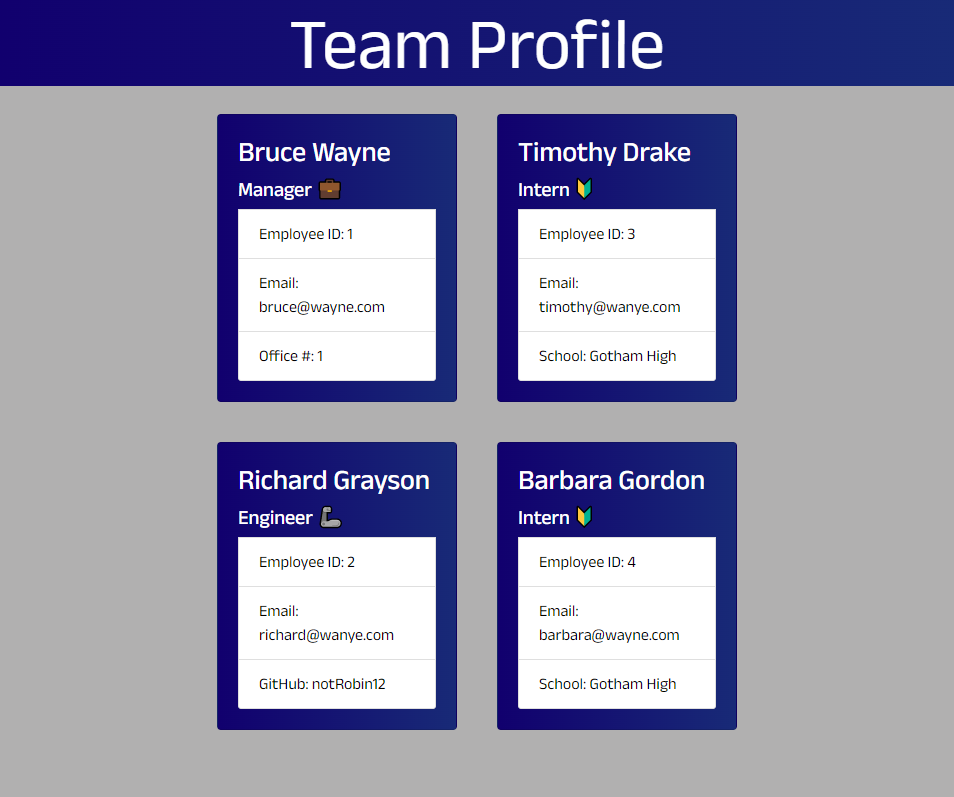

# Team-Profile-Generator

## Table of Contents

* [Licensing](#licensing)
* [Installation](#installation)
* [Usage](#usage)
* [Contribution](#contribution)
* [Test](#test)
* [Questions](#questions)

## Licensing 

> Team-Profile-Generator is protected and licensed under the [MIT](https://opensource.org/licenses/MIT) license.

## Description

This application generates an HTML page after receiving user input through a series of questions using the inquirer npm package.
  
## Installation

Clone this repository, navigate to the cloned directory in terminal, then run 'npm install'

## Usage

After installation, run 'node index.js' in terminal, then follow the prompts in your terminal to generate your team profile page.

## Test

> npm run test

[Walkthrough Video](./assets/walkthrough.mp4)

> ## Page Preview: 

## Question

Please reach out to me at vyang1014888@gmail.com with any questions or issues.

You can find more of my work on my GitHub page at https://github.com/vyang14/.
